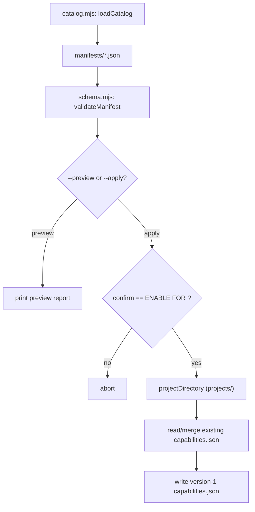

# Capability packs

`tools/capabilities/` is the optional capability pack catalog, run as `pnpm capability:add`. It records, per project, which optional runtime boundaries are enabled by writing an auditable `capabilities.json` into the project capsule — it does not install runtime integration.

## Purpose

The catalog lets a project explicitly opt into optional capabilities (Stripe, email, Electron, WXT, AI, Python) that are not part of the baseline runtime. Each capability is declared by a validated manifest that pins its risk tier, dependencies, environment variables, commands, tests, sensitive paths, side effects, and removal procedure. Selecting a capability records a signed decision rather than silently adding dependencies.

## Key source files

| File | Responsibility |
| --- | --- |
| `tools/capabilities/src/cli.mjs` | CLI entry: preview or apply a capability |
| `tools/capabilities/src/catalog.mjs` | Loads manifests, previews, and applies capability records |
| `tools/capabilities/src/schema.mjs` | Manifest and record validation, risk ordering |
| `tools/capabilities/manifests/stripe.json` | Stripe sandbox webhook boundary |
| `tools/capabilities/manifests/email.json` | Local email / React Email boundary |
| `tools/capabilities/manifests/electron.json` | Electron desktop shell |
| `tools/capabilities/manifests/wxt.json` | WXT browser extension shell |
| `tools/capabilities/manifests/ai.json` | Provider-neutral AI boundary |
| `tools/capabilities/manifests/python.json` | Python technical boundary (justification-gated) |

## How it works

The tool loads every manifest in `tools/capabilities/manifests/`, validates each against a required-field schema, and previews exactly which files will change before any write occurs.

Notable behaviors:

- **Manifest validation** (`schema.mjs`) requires every manifest to declare `id`, `label`, `description`, `risk`, `dependencies`, `environment`, `commands`, `tests`, `sensitivePaths`, `sideEffects`, and `removal`. Ids must match the manifest filename and be safe slugs; risk must be R1, R2, or R3.
- **Applying** merges the selected capability into the existing `projects/<project>/capabilities.json`, deduplicating by id and taking the `maximumRisk` of the current and new risk. Duplicate ids are rejected.
- **Python justification**: because `python.json` is the one capability gated on technical justification, applying it requires a non-empty `--justification` proving Node.js is unsuitable.
- **All six manifests are R2** boundaries (payments, auth-adjacent delivery, desktop privileges, browser extensions, external model calls, and a second-language runtime), so each records the risk tier alongside the opt-in.
- The selection writes an audit record only — runtime integration remains a project-scoped R2 task, as stated in the preview output.

## Integration points

- Runs as `pnpm capability:add --capability <id> --project <slug>`; also supports `--preview`, `--apply`, `--repo-root`, `--confirm`, and `--justification`.
- Writes to each project capsule's `projects/<project>/capabilities.json`, the canonical per-project capability record.
- Capability selection feeds risk classification and sensitive-path scanning; see [SAFRS governance](../features/safrs-governance.md).
- Related pages: [Glossary](../overview/glossary.md) (definition of capability pack), [Getting started](../overview/getting-started.md), and [Project wizard](project-wizard.md).
