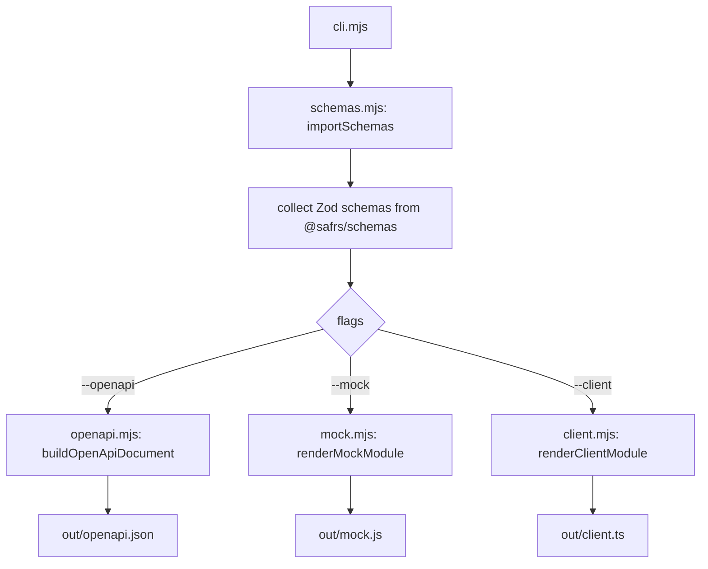

# Schema-first codegen

`tools/codegen/` reads Zod schemas from `@safrs/schemas` — the single source of truth for API contracts — and generates three artifacts: an OpenAPI 3.1 document, mock data factories, and a typed fetch wrapper over the Hono client. It is run as `pnpm codegen`.

## Purpose

Codegen keeps generated contracts honest and deterministic: the same schema input always produces the same bytes, and generated files are never hand-maintained. It turns the Zod schemas in `packages/schemas/src/` into an OpenAPI document for external documentation/tooling, standalone mock factories for testing, and a typed client wrapper that layers timeout/retry/resilience over the Hono RPC client.

## Key source files

| File | Responsibility |
| --- | --- |
| `tools/codegen/src/cli.mjs` | CLI entry: parses options, imports schemas, writes artifacts |
| `tools/codegen/src/schemas.mjs` | Schema introspection, type-name inference, mock value walker |
| `tools/codegen/src/openapi.mjs` | Builds the OpenAPI 3.1 document via `z.toJSONSchema` |
| `tools/codegen/src/mock.mjs` | Renders the standalone mock-data module |
| `tools/codegen/src/client.mjs` | Renders the typed fetch-wrapper module |
| `tools/codegen/AGENTS.md` | Scope and rules for the codegen tool |
| `packages/schemas/src/` | The Zod schema source of truth |

## How it works

The CLI imports the entry module at runtime, collects every exported Zod schema, and dispatches to the generators. If no `--openapi`/`--mock`/`--client` flag is given, all three are produced.

Notable behaviors:

- **Schema introspection** (`schemas.mjs`) detects Zod schemas without importing the full Zod type surface (checking the `_def` marker and `safeParse`), infers the type name from the Zod 4 `_def.type` discriminator, and walks a schema tree to produce deterministic `@faker-js/faker` mock values with a recursion depth guard.
- **OpenAPI generation** (`openapi.mjs`) uses Zod 4's native, dependency-free `z.toJSONSchema(...)` (draft 2020-12) to produce an OpenAPI 3.1 document with a `paths` placeholder and each schema under `components.schemas`.
- **Mock module** (`mock.mjs`) emits a standalone `mock.js` that imports the live schema objects and walks them at runtime, so the generated file stays correct as schemas evolve. Each schema gets a `mock<Name>(overrides = {})` factory and a `mockableSchemas` list.
- **Client module** (`client.mjs`) emits `client.ts` — a typed wrapper around `createApiClient` from `@safrs/api/client` that adds a configurable timeout (`AbortController`) and retry-on-network-error, normalizing results into a `{ ok, value } | { ok, error }` envelope.

## Integration points

- Runs as `pnpm codegen`; supports `--schema`, `--out`, `--openapi`, `--mock`, `--client`, `--title`, and `--version` flags.
- Reads the canonical Zod contracts from `packages/schemas/src/` and targets the Hono client at `@safrs/api/client` — it never hand-maintains a second copy of the schemas.
- Generated output is determinant and declared in the consuming project's `AGENTS.md`/`.gitignore` as needed; it is not forced into the golden-path build.
- Codegen, dependency, and generated-output changes are R2. See [Patterns and conventions](../how-to-contribute/patterns-and-conventions.md) for the schema-first contract approach and [Tooling](../how-to-contribute/tooling.md) for how generated code fits the build.
