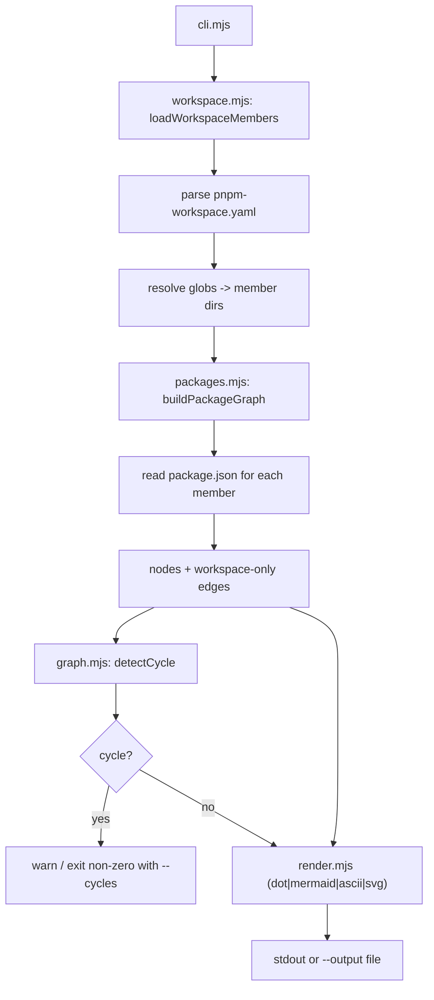

# Dependency graph visualizer

`tools/deps-graph/` is a standalone, read-only dependency-graph visualizer for the monorepo, run as `pnpm deps:graph`. It parses `pnpm-workspace.yaml`, and every `package.json` to build the inter-package dependency graph, detects circular dependencies, and renders it as DOT, Mermaid, ASCII, or SVG.

## Purpose

The tool gives a quick, dependency-free view of how packages depend on one another, and it detects cycles — important in a pnpm workspace where circular dependencies break builds. It is explicitly a manual/CI-optional aid, not a governance gate: it never mutates packages, manifests, or lockfiles.

## Key source files

| File | Responsibility |
| --- | --- |
| `tools/deps-graph/src/cli.mjs` | CLI entry: parses flags, builds the graph, detects cycles, renders output |
| `tools/deps-graph/src/workspace.mjs` | Minimal YAML parser for `pnpm-workspace.yaml` and glob resolution |
| `tools/deps-graph/src/packages.mjs` | Reads package metadata and builds nodes/edges |
| `tools/deps-graph/src/graph.mjs` | DFS cycle detection and reverse-edge lookup |
| `tools/deps-graph/src/render.mjs` | DOT, Mermaid, ASCII, and SVG renderers |
| `tools/deps-graph/AGENTS.md` | Scope and rules for the tool |

## How it works

The pipeline has distinct, separable stages: workspace membership, graph construction, cycle detection, and rendering.

Notable behaviors:

- **Zero runtime dependencies** — `workspace.mjs` hand-parses the simple `pnpm-workspace.yaml` structure (extracting only the `packages:` list) and expands only trailing `*` glob segments, matching the `projects/*/apps/*`, `packages/*` patterns in this repo.
- **Graph construction** (`packages.mjs`) reads `name` and the dependency sections (`dependencies`, `devDependencies`, `peerDependencies`, `optionalDependencies`) of each member's `package.json`, keeping only edges to other workspace members.
- **Cycle detection** (`graph.mjs`) runs a standard depth-first search with WHITE/GRAY/BLACK coloring and returns the first back-edge cycle as a node path. `dependentsOf()` returns reverse edges.
- **Rendering** (`render.mjs`) produces deterministic DOT, Mermaid (`flowchart LR`), and ASCII output. SVG rendering shells out to the Graphviz `dot` binary when available and falls back to Mermaid if `dot` is missing.
- The CLI prints the detected cycle and, with `--cycles`, exits non-zero when a cycle exists.

## Integration points

- Runs as `pnpm deps:graph`; supports `--format dot|mermaid|ascii|svg`, `--output <path>`, `--repo-root`, `--cycles`, and `--help`.
- Reads `pnpm-workspace.yaml` and `turbo.json`/`package.json` manifests as data only — it never writes or changes them.
- Read-only and **not** a governance gate by design; wiring it into CI or governance would raise it to R2 (see `tools/deps-graph/AGENTS.md`).
- Works alongside the other repo-wide tools; see the [tool overview](index.md) and [Architecture](../overview/architecture.md) for the package dependency layout.
