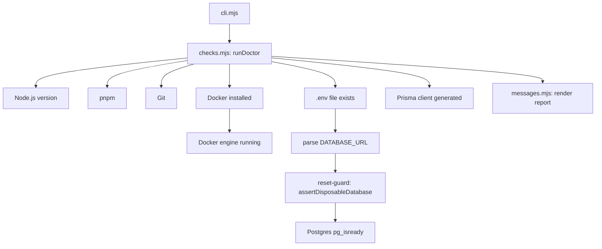

# Doctor environment diagnosis

`tools/doctor/` is the environment-readiness CLI, run as `pnpm doctor`. It checks whether the local development environment can run the monorepo and reports a human-readable readiness report in Bahasa Indonesia, optionally with technical details, plus redacted diagnostic output.

## Purpose

Doctor validates the local environment before development begins: Node.js version, pnpm, Git, Docker, the `.env` file, the disposable Postgres database, and the generated Prisma client. It is strictly read-only — it runs commands and reads files but never mutates them. Its exit code reflects readiness (`0` ready, `1` recoverable issue, `2` unsafe configuration), which lets scripts and agents react to the result.

## Key source files

| File | Responsibility |
| --- | --- |
| `tools/doctor/src/cli.mjs` | Entry point; runs `runDoctor()` and maps the report to an exit code |
| `tools/doctor/src/checks.mjs` | Runs all readiness checks and builds the report |
| `tools/doctor/src/messages.mjs` | Renders human/technical reports and redacts secrets |
| `tools/doctor/test/checks.test.mjs` | Unit tests for the checks |
| `packages/database/src/reset-guard.ts` | Rejects non-disposable `DATABASE_URL` (imported by Doctor) |

## How it works

Doctor composes a list of checks, each producing a `{ ok, severity, area, summary, recovery, technical }` result. Checks run sequentially, with later database checks depending on earlier ones (for example, the Postgres readiness check only runs when `DATABASE_URL` is safe and Docker is up).

Key behaviors:

- **Node version** is validated against `{ major: 24, minimumMinor: 18 }` via `nodeCompatible()`.
- **Database safety** runs the URL through `assertDisposableDatabase()` from `packages/database/src/reset-guard.ts`. A non-disposable `DATABASE_URL` is flagged with severity `unsafe`, which sets exit code `2` and blocks proceeding.
- **Secret redaction** (`messages.mjs`) replaces URL credentials, `*PASSWORD*`/`*TOKEN*`/`*KEY*`/`*SECRET*` assignments, and known environment values with placeholder text before printing, so diagnostics never leak secrets.
- The canonical environment is loaded from `.env`, and only `DATABASE_URL`, `APP_URL`, and `NODE_ENV` are read.

## Integration points

- Wired into the daily workflow and the golden-path baseline as `pnpm doctor` (see [Getting started](../overview/getting-started.md)).
- Reuses the shared disposable-database guard from `packages/database/src/reset-guard.ts` without duplicating the rule.
- Runs via the process helper in `scripts/lib/process.mjs` (`runCommand`, `packageManagerCommand`).
- Doctor is a diagnostic aid, not a governance gate; see [Tooling](../how-to-contribute/tooling.md) for how it fits with the broader toolchain.
