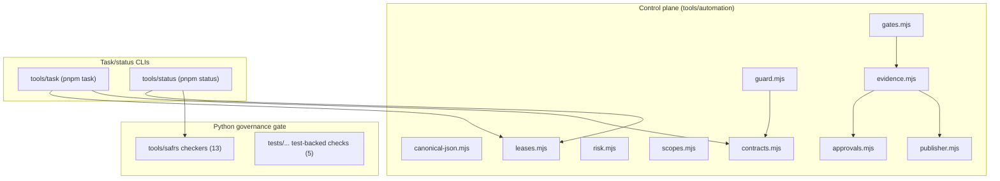

# Repository tools

## Purpose

`tools/<tool>/` owns repository-wide developer tooling: diagnosis, project capsules, optional capability manifests, deterministic SAFRS enforcement, and the automation control plane. Tool, governance, generated-project, dependency, or verification-control changes are R2 and need review (`tools/AGENTS.md`).

There are nine tools:

| Tool | Command | Role |
| --- | --- | --- |
| [SAFRS governance checkers](safrs.md) | `pnpm governance` / `pnpm saf:verify` | Deterministic machine-enforced governance (Python checkers + test-backed checks) |
| [Automation control plane](automation.md) | `pnpm saf` | Canonical contracts, leases, gates, evidence, approvals, publisher |
| [Task CLI](task.md) | `pnpm task` | Claim, transition, close, and list mutation tasks in the shared registry |
| [Status CLI](status.md) | `pnpm status` | Read-only report of registry, leases, git state, and live governance |
| [Doctor](doctor.md) | `pnpm doctor` | Read-only environment diagnosis before setup/dev |
| [Project wizard](project-wizard.md) | `pnpm project:new` | Scaffold a SAFRS project capsule from the template |
| [Capabilities](capabilities.md) | `pnpm capability:add` | Select optional capabilities for a project capsule |
| [Codegen](codegen.md) | `pnpm codegen` | Zod → OpenAPI / mocks / typed client generation |
| [Deps-graph](deps-graph.md) | `pnpm deps:graph` | Read-only inter-package dependency graph visualizer |

## Governance and the control plane

The two most consequential tools are the governance checkers and the automation control plane:

- **SAFRS governance checkers** (`tools/safrs/`) are deterministic Python scripts executed by `scripts/safrs-verify.sh` (and the PowerShell twin `scripts/safrs-verify.ps1`) via the `pnpm governance` entrypoint. They enforce the policy tiers, document registry, tool inventory, repository topology, workflow pinning, session handoff, task ownership, lifecycle agreement, and approval/evidence integrity — see [SAFRS governance checkers](safrs.md).
- **The automation control plane** (`tools/automation/`) is the Node-side implementation of ADR 0002: canonical JSON contracts, monotonic risk, scope safety, a vendor-neutral guard, lease chains, budget ledgers, eight PR gates, evidence manifests, approval verification, and a publisher identity. It is a **verification control**; every change is at least R2. See [Automation control plane](automation.md) for the full detail.

## Rules for tool changes

- Tools must treat external input as data, validate paths, preserve user-owned files, and avoid secrets or network access unless separately authorized (`tools/AGENTS.md`).
- New tools that access repository data, credentials, or network endpoints must be declared in `.safrs/tool-inventory.json` (`tools/README.md`).
- The `deps-graph` tool is deliberately **not** a governance gate; it is a manual/CI-optional aid.
- Run focused tool tests first, then `pnpm run doctor` (read-only diagnostics) and `pnpm run governance` (SAFRS checks).

## Related pages

- [Automation control plane](automation.md) — contracts, leases, gates, evidence, publisher
- [SAFRS governance checkers](safrs.md) — the Python enforcement suite
- [Task CLI](task.md) — mutation-task registry
- [Status CLI](status.md) — control-plane health report
- [Packages](../packages/index.md) — the shared packages these tools operate on (codegen, deps-graph)
- [SAFRS governance (features)](../features/safrs-governance.md) — risk model, roles, verification
- [Automation control plane (features)](../features/automation-control-plane.md) — end-to-end lifecycle
