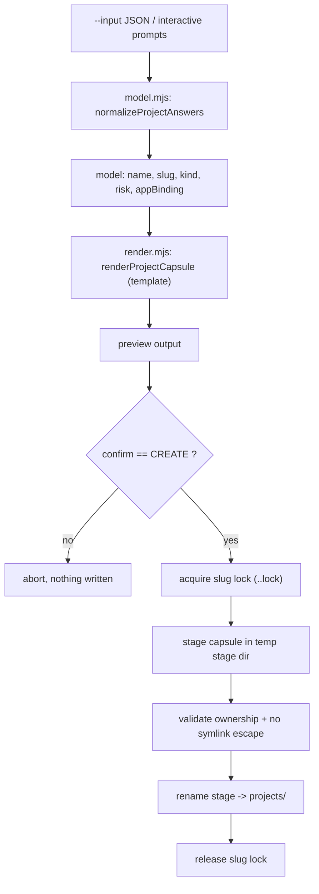

# Project wizard

`tools/project-wizard/` scaffolds a new SAFRS project capsule, run as `pnpm project:new`. It renders the capsule files from the template at `projects/_template/`, interpolating the wizard's answers, with no-clobber, owner-checked file publication protected by a per-slug lock.

## Purpose

The wizard creates a governance capsule (not application code): it produces the `AGENTS.md`, `README.md`, and `docs/*` files for a new project so the capsule conforms to SAFRS and passes topology checks. It parses untrusted answers into a bounded project model, computes the minimum risk tier including R2-triggering terms, and treats all inputs as data — validating paths and rejecting symbolic-link escapes throughout.

## Key source files

| File | Responsibility |
| --- | --- |
| `tools/project-wizard/src/cli.mjs` | CLI entry: arg parsing, interactive prompts, confirmation, capsule application |
| `tools/project-wizard/src/model.mjs` | Normalizes answers into a bounded, validated project model with slugging and risk computation |
| `tools/project-wizard/src/render.mjs` | Renders capsule files from the `projects/_template/` template |
| `tools/project-wizard/package.json` | Defines the `test` script |
| `projects/_template/` | Template capsule files (the rendering source) |

## How it works

The wizard has two distinct pipeline stages: a pure normalization/rendering stage and a file publication stage with strict ownership.

Notable behaviors:

- **Model normalization** (`model.mjs`) slugifies the project name, rejects control characters and path traversal, guards against reserved Windows names, restricts `kind` to `web`/`desktop`/`extension`, and bounds `appBinding` below `apps/`. It computes the minimum risk from the answers — any R2-triggering term (healthcare, finance, payments, auth, shared-package, migrations) or a shared-package impact upgrades the risk to at least R2.
- **Template rendering** (`render.mjs`) reads only the required template files (`AGENTS.md`, `README.md`, `docs/architecture.md`, `docs/data.md`, `docs/testing.md`, `src/README.md`, `tests/README.md`), refuses symbolic-link paths that escape the template root, and fails if any `{{...}}`/`<...>`/`${...}` marker remains.
- **Locked, no-clobber publication** reserves the destination with a per-slug lock and an incompletion marker, verifies ownership by inode + UUID marker before any rename or delete, and quarantines rather than blindly deleting on cleanup. On Windows it renames the staged directory into place because of platform rename semantics.
- **Interactive confirmation** is required — the user must type exactly `CREATE <slug>` to write anything.

## Integration points

- Runs as `pnpm project:new`; supports `--preview`, `--apply`, `--input`, `--repo-root`, and `--confirm` flags.
- Reads the canonical template from `projects/_template/`, which is also enforced by `tools/safrs/check_topology.py`.
- Generated project capsules are validated by the SAFRS governance gate; see [SAFRS governance](../features/safrs-governance.md).
- See [Getting started](../overview/getting-started.md) for the daily workflow and [Patterns and conventions](../how-to-contribute/patterns-and-conventions.md) for project conventions.
