# SAFRS governance checkers

## Purpose

`tools/safrs/` contains the deterministic, machine-enforced governance gate for the repository. Each checker is a small Python 3 script that reads repository state (manifests, registries, the Git worktree, the control plane) and exits non-zero on any violation — there is no advisory mode and no bypass: *fail closed*.

The gate is invoked by `pnpm governance` (and `pnpm saf:verify`), which delegates to `scripts/safrs-verify.sh` on POSIX or `scripts/safrs-verify.ps1` on Windows. The two scripts run the identical check list. Running the gate is mandatory before declaring work complete (root `AGENTS.md`, rule 10).

## The verification gate

`scripts/safrs-verify.sh` (and its `.ps1` twin) executes the **16-checker pipeline** documented repository-wide: **13 `tools/safrs/check_*.py` checkers** plus the **supporting test-backed checks** in `tests/`. The design-token contrast gate (`scripts/check-tokens.mjs`) runs in the same governance pass via `pnpm check`. The gate succeeds with `SAFRS local governance verification: PASS`.

> **Note on the count.** The "16" figure (used across this wiki) predates the two newest automation test files; the exhaustive list below is authoritative. Concretely the gate runs the **13 checkers from `tools/safrs/` followed by the 5 test-backed checks** listed here (18 Python invocations). The three older test suites (`test_safrs_topology.py`, `test_sensitive_classification.py`, `test_task_ownership.py`) plus the 13 checkers form the original 16 named checkers.

```mermaid
graph TD
    subgraph gate["pnpm governance → scripts/safrs-verify.sh | .ps1"]
        P["check_policy.py"]
        D["check_docs.py"]
        R["check_routing.py"]
        TI["check_tool_inventory.py"]
        TP["check_topology.py"]
        AP["check_actions_pinning.py"]
        AUP["check_automation_policy.py"]
        TC["check_task_contract.py"]
        TO["check_task_ownership.py"]
        L["check_lifecycle.py"]
        AE["check_approval_evidence.py"]
        SC["check_sensitive_changes.py"]
        H["check_handoff.py"]
        T1["tests/architecture/test_safrs_topology.py"]
        T2["tests/governance/test_sensitive_classification.py"]
        T3["tests/governance/test_task_ownership.py"]
        T4["tests/governance/test_automation_contracts.py"]
        T5["tests/governance/test_automation_approvals.py"]
    end
    P --> OUT["SAFRS local governance verification: PASS"]
    D --> OUT
    R --> OUT
    TI --> OUT
    TP --> OUT
    AP --> OUT
    AUP --> OUT
    TC --> OUT
    TO --> OUT
    L --> OUT
    AE --> OUT
    SC --> OUT
    H --> OUT
    T1 --> OUT
    T2 --> OUT
    T3 --> OUT
    T4 --> OUT
    T5 --> OUT
```



## Checker inventory (13 checkers in `tools/safrs/`)

The checkers grew from 8 to 13 with five additions (marked **new**) that extend governance from static policy into the automation control plane — task contracts, ownership, lifecycle, automation policy, and approval/evidence integrity.

### Phase 1 baseline checkers

| Checker | Enforces |
| --- | --- |
| `tools/safrs/check_policy.py` | `.safrs/policy.json` must define exactly R0–R3, require `human_authorization` for R3, forbid `read-production-secrets` / `direct-production-deploy` / `self-authorize-R3` by default, declare the monorepo topology, require dedicated-worktree isolation, and reference the tool inventory |
| `tools/safrs/check_docs.py` | `.safrs/document-registry.json` — unique document ids/paths, allowed status/type, `superseded_by` forward references, normativity/scope pairing, unique `read_order` only under `MUST` |
| `tools/safrs/check_routing.py` | The `AGENTS.md` routing block must be byte-identical to the block `generate_routing.py` derives from the registry; routed documents must exist; required anchors present; deprecated `.cursorrules` absent |
| `tools/safrs/check_tool_inventory.py` | `.safrs/tool-inventory.json` — `deny-unless-task-authorized` default network policy, required fields per tool, unique ids, valid `review_status`, and the four mandatory local tools (`local-filesystem`, `git`, `python3`, `bash`) |
| `tools/safrs/check_topology.py` | Required repository topology paths exist (projects, packages, tools, docs, tests, `.cursor/rules/01-safrs.mdc`, …); every non-template project capsule has `AGENTS.md`, `README.md`, `docs/architecture.md`, `docs/data.md`, `docs/testing.md`, `src`, `tests`; no unresolved activation placeholders |
| `tools/safrs/check_actions_pinning.py` | GitHub workflow safety — third-party actions pinned to a full 40-hex SHA, no shell-piped installers, no unrestricted autonomous flags, HTTPS-only downloads from endpoints registered in the tool inventory |
| `tools/safrs/check_sensitive_changes.py` | Classifies changed files against `.safrs/sensitive-paths.json`, prints `SAFRS_RISK=R1|R2|R3`, and rejects coupled implementation + verification-control change sets unless a strict independent integrity-review artifact matches the exact change-set fingerprint |
| `tools/safrs/check_handoff.py` | Session handoff — a non-trivial change set (anything beyond `.agents/` memory files) must include `.agents/HANDOFF.md` |

### New automation-control-plane checkers

| Checker | Enforces |
| --- | --- |
| `tools/safrs/check_automation_policy.py` | `.safrs/automation-policy.json` + `.safrs/adapter-capabilities.json` — v1 schema, risk order R0–R3, positive `max_expiry_hours`, valid operation/capability risks, approval defaults covering exactly R0–R3, `r3.prepare_only`/production-adapters/free-form-shell constraints, the seven `*.v1.schema.json` files with `additionalProperties: false`, budget dimensions matching the task-contract schema, and the Droid adapter pinned to `read_only_disabled` pending Activation Decision 4 |
| `tools/safrs/check_task_contract.py` | Every stored task contract (`tests/fixtures/automation/contracts/`, `.safrs/contracts/`) validates against `task-contract.v1.schema.json` and its SHA-256 `contract_digest` recomputes byte-identically. Doubles as the **cross-language digest-parity gate** — canonical JSON here must match the Node implementation in `tools/automation/src/canonical-json.mjs` |
| `tools/safrs/check_task_ownership.py` | The shared `active-tasks.json` registry snapshot — schema, safe path prefixes (no absolute paths, wildcards, `..`), ISO-8601 UTC timestamps, valid states/risks (R0 cannot be mutation-active), no expired mutation-active tasks, no overlapping mutation-active scopes, and every changed path owned by exactly one active task in the current worktree |
| `tools/safrs/check_lifecycle.py` | Semantic agreement between the task registry and the lease ledger — every local lease-event chain is digest- and sequence-contiguous with monotonic fencing tokens; a mutation-active task must not sit on a terminal chain (and vice versa); the chain's scope digest matches the registry claim; `.agents/HANDOFF.md` and `.agents/PROGRESS.md` exist |
| `tools/safrs/check_approval_evidence.py` | `.safrs/approvals/*.json` and `.safrs/evidence/*.json` — known approval kinds with required bindings, no self-review, issue/expiry ordering, R2 diff-digest bindings, R3 operation/target/idempotency fields, sealed manifest digest recomputation, and no secret-shaped content that survived redaction |

### Generator (not a standalone gate)

| File | Purpose |
| --- | --- |
| `tools/safrs/generate_routing.py` | Regenerates the `AGENTS.md` read-order block from `.safrs/document-registry.json` (or `--check` drift). `check_routing.py` imports it and enforces that the committed block matches |

## Test-backed checks (5 in `tests/`)

These complete the gate and reuse the same Python tooling:

| Check | Purpose |
| --- | --- |
| `tests/architecture/test_safrs_topology.py` | Topology invariants (mirrors `check_topology.py`) |
| `tests/governance/test_sensitive_classification.py` | Risk classification invariants |
| `tests/governance/test_task_ownership.py` | Registry/ownership invariants |
| `tests/governance/test_automation_contracts.py` | Node/Python contract-digest parity for automation contracts |
| `tests/governance/test_automation_approvals.py` | Approval-record validation invariants |

## CLI usage

```bash
pnpm governance            # run the full gate (POSIX: .sh, Windows: .ps1)
pnpm saf:verify            # alias for the same gate
python tools/safrs/check_handoff.py          # run one checker directly
python tools/safrs/generate_routing.py       # regenerate the AGENTS.md routing block
python tools/safrs/generate_routing.py --check
```

A Python 3 interpreter is required; the scripts select `python3` then fall back to `python` and refuse to run otherwise.

## Integration points

- **`pnpm check`** runs `pnpm governance` first, so every lint/typecheck/test/build pipeline starts from a green governance gate.
- **CI** (`pnpm run governance` in `.github/workflows/`) enforces the same checks in pull requests.
- **`tools/status`** runs the gate live and parses failing checker names from its output (`tools/status/src/cli.mjs`).
- **`tools/automation`** is mirrored by `check_automation_policy.py` and `check_task_contract.py` — canonical JSON and digests must stay byte-identical between Node and Python, Windows and Linux (`tools/automation/AGENTS.md`).
- **`tools/task`** writes the shared registry and local lease ledger that `check_task_ownership.py` and `check_lifecycle.py` validate.
- **`tools/doctor`** reuses `packages/database/src/reset-guard.ts` for its database safety check.

## Related pages

- [Automation control plane](automation.md) — the Node side of the control-plane contracts
- [Status CLI](status.md) — live governance probe
- [Task CLI](task.md) — writes the registry the ownership checkers validate
- [Doctor](doctor.md) — read-only environment diagnosis
- [SAFRS governance (features)](../features/safrs-governance.md) — risk model, roles, verification
- [Tools overview](index.md)
