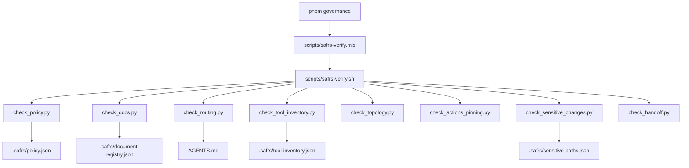

# SAFRS governance checkers

The `tools/safrs/` directory holds the deterministic governance checkers that enforce the SAFRS v1.1 repository standard. They are invoked in a fixed sequence by `scripts/safrs-verify.sh`, exposed to developers as `pnpm governance` via `scripts/safrs-verify.mjs`. One generator (`generate_routing.py`) rewrites the agent context-routing block in the root `AGENTS.md` from the document registry.

## Purpose

These checkers make SAFRS governance machine-enforced rather than advisory. Each checker validates one invariant of the repository against its authoritative manifest (`.safrs/*.json`), exiting non-zero on drift. They are the executable layer (L4) of the governance architecture and are classification-critical: `check_sensitive_changes.py` refuses to guess a risk level when git cannot answer, rather than silently lowering risk.

## Key source files

| File | Responsibility |
| --- | --- |
| `tools/safrs/check_policy.py` | Validates `.safrs/policy.json`: risk tiers, forbidden capabilities, repository topology, isolation |
| `tools/safrs/check_docs.py` | Validates `.safrs/document-registry.json` integrity |
| `tools/safrs/check_routing.py` | Ensures `AGENTS.md` routing block matches the registry-derived block |
| `tools/safrs/check_tool_inventory.py` | Validates `.safrs/tool-inventory.json` |
| `tools/safrs/check_topology.py` | Ensures required repository topology paths exist |
| `tools/safrs/check_actions_pinning.py` | Enforces full-SHA pinning of third-party GitHub Actions |
| `tools/safrs/check_sensitive_changes.py` | Classifies changed files by SAFRS risk; refuses to guess |
| `tools/safrs/check_handoff.py` | Enforces the session handoff protocol |
| `tools/safrs/generate_routing.py` | Generates the `AGENTS.md` read-order block from the registry |
| `scripts/safrs-verify.sh` | Bash runner that sequentially executes all checkers |
| `scripts/safrs-verify.mjs` | Cross-platform wrapper (`pnpm governance`) |

## How it works

The checkers share a common structure: each resolves the repository root, reads the authoritative JSON manifest under `.safrs/`, and compares it against the invariant it owns.

Notable behaviors:

- **`check_policy.py`** requires the risk tiers to be exactly `{R0, R1, R2, R3}`, R3 to require `human_authorization: true`, the mandatory forbidden capabilities to be present, the repository fields to match (monorepo, default branch `main`, capsule root `projects`, etc.), and parallel mutation to require a dedicated worktree.
- **`check_routing.py`** imports `generate_routing.py` at runtime and compares the registry-derived block against the current block in `AGENTS.md`. If they drift, it instructs the developer to rerun `generate_routing.py`.
- **`check_sensitive_changes.py`** reads `SAFRS_BASE_REF`/`SAFRS_HEAD_REF` env vars to diff the change set. If no base is set, it falls back to staged + unstaged + untracked names. It rejects change sets where verification controls and implementation changed together (exit codes: 0 OK, 1 policy violation, 2 cannot classify). It never guesses a risk level.
- **`check_handoff.py`** requires non-trivial change sets to touch `.agents/HANDOFF.md`, exempting memory-file-only changes.
- **`generate_routing.py`** derives the `MUST`/`SHOULD`/`MAY` read-order from document registry entries annotated with `normativity` and `scope`, and supports `--check` for drift detection.

## Integration points

- Wired into the repository gate: `pnpm governance` (`.safrs/**`, governance scripts, and CI count as verification controls, so changes are minimum R2).
- Pipeline order in `scripts/safrs-verify.sh` also includes two Python test files — `tests/architecture/test_safrs_topology.py` and `tests/governance/test_sensitive_classification.py` — alongside the checkers.
- `check_routing.py` and `generate_routing.py` keep the agent context routing in `AGENTS.md` in sync with `.safrs/document-registry.json`.
- See [SAFRS governance](../features/safrs-governance.md) for the risk model and roles, and [Patterns and conventions](../how-to-contribute/patterns-and-conventions.md) for verification-integrity rules.
