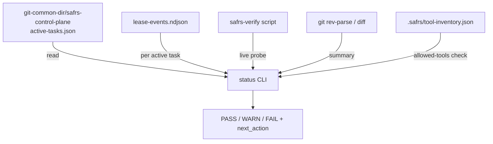

# Status CLI

## Purpose

`pnpm status` (implemented in `tools/status/src/cli.mjs`) is a read-only diagnostic that summarizes the state of the SAFRS automation control plane in one report: the shared task registry, lease state, the live governance verification result, and a git summary of the current worktree. It is the quickest way to see whether work is safely claimable and where verification stands before running heavier checks.

## Key source files

| File | Purpose |
| --- | --- |
| `tools/status/src/cli.mjs` | Report assembly and rendering (`pnpm status`) |
| `tools/task/src/ownership.mjs` | Registry validation, overlap detection, redaction, public-task projection |
| `tools/task/src/storage.mjs` | Shared registry and local lease-ledger access |
| `tools/automation/src/leases.mjs` | Lease chain verification and replay |
| `scripts/safrs-verify.sh` / `scripts/safrs-verify.ps1` | Live governance probe the report runs |

## How it works

`tools/status/src/cli.mjs` builds a single report from several sources:

- **Task registry** — reads `active-tasks.json` from the Git common directory control plane (`git-common-dir/safrs-control-plane`), validates it via `tools/task/src/ownership.mjs`, and projects each task through `publicTask` (which redacts notes, paths, and secret-shaped values).
- **Ownership overlap** — `findOverlapConflicts` detects mutation-active tasks with overlapping scopes; any conflict makes ownership `ok: false`.
- **Governance** — runs the repository's own verification script (`safrs-verify.ps1` on Windows, `safrs-verify.sh` otherwise) and parses its output for failing Python checkers. It stays read-only relative to the registry: if the governance probe changes the registry `mtime`, it reports `unknown` with a `status-detected-registry-mtime-change` failure.
- **Lease state** — for each mutation-active task it reads the local `lease-events.ndjson` ledger and reports chain validity, fencing token, last event type, and whether the chain has been reconciled with the remote authority (`authority_run_url` present).
- **Git summary** — current branch, abbreviated HEAD, dirty path count, and a sample of redacted changed paths.
- **Tool inventory warnings** — flags `allowed_tools` ids that do not exist in `.safrs/tool-inventory.json`.

The report computes a status of `PASS`, `WARN`, or `FAIL` and a concrete `next_action`. Human output is in Bahasa Indonesia and runs through `redactText`; `--json` emits the raw report.



## CLI usage

```bash
pnpm status          # human summary (Bahasa Indonesia, redacted)
pnpm status --json   # raw JSON report
```

The command exits `0` on `PASS`/`WARN` and `1` on `FAIL`.

## Integration points

- Reuses registry and ownership logic from `tools/task/src` and lease primitives from `tools/automation/src`; see [Task CLI](task.md) and [Automation control plane](automation.md).
- Runs the repository's own verification script, so it reports the same governance signal as `pnpm governance`.
- Owns no mutable state — it only reads the shared control plane.

## Related pages

- [Task CLI](task.md) — claim, state, close, list
- [Automation control plane](automation.md) — contracts, leases, gates, evidence
- [Automation control plane (features)](../features/automation-control-plane.md) — end-to-end lifecycle
- [SAFRS governance](../features/safrs-governance.md) — risk model, roles, verification
- [Architecture](../overview/architecture.md) — control plane in the six-layer model
